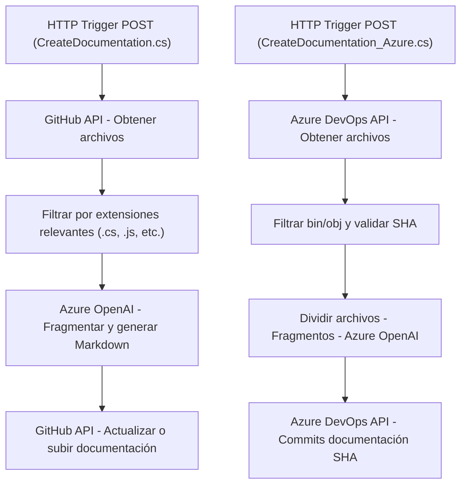

### **Breve resumen técnico**
El repositorio contiene un sistema basado en **Azure Functions Serverless**, cuyo propósito principal es automatizar la generación de documentación técnica en formato Markdown. Utiliza servicios externos como GitHub, Azure DevOps y Azure OpenAI para análisis y generación de contenido. Cada archivo de código representa una **función Azure** (microservicio independiente) responsable de manejar tareas específicas como extracción de contenido, procesamiento y creación de documentos.

---

### **Descripción de arquitectura**
- **Tipo de solución**: 
  Sistema **Serverless** orientado al procesamiento de datos y generación automática de documentación técnica.

- **Arquitectura**:
  - Se basa en un enfoque **microservicio** o **granular serverless**, donde cada Azure Function maneja su propia lógica de negocio de forma independiente.
  - Cada Function es activada por un evento (petición HTTP), siguiendo principios de **Event-Based Architecture**.
  - Uso de **Integración API-driven** para interactuar con terceros como GitHub, Azure DevOps y OpenAI.

---

### **Tecnologías usadas**
1. **Frameworks** y **plataformas**:
   - Azure Functions para implementación **serverless**.
   - Hosting en un entorno **Functions Worker SDK** (provisto por `Microsoft.Azure.Functions.Worker`).
   - Application Insights para monitoreo (comentado en el código).
   
2. **Lenguaje de programación**:
   - C# (.NET Core).

3. **APIs externas**:
   - GitHub API: Recuperación y modificación de archivos en repositorios.
   - Azure DevOps API: Gestión de repositorios en Azure DevOps.
   - Azure OpenAI API: Generación automatizada de documentación técnica.

4. **Librerías .NET**:
   - `System.Net.Http` para integrar APIs externas.
   - Logging con `Microsoft.Extensions.Logging`.
   - Serialización JSON con `System.Text.Json`.

---

### **Componentes externos que podrían estar presentes**
- **Azure OpenAI**: Acceso mediante clave API (variable de entorno `OPENAI_API_KEY`).
- **GitHub API** y/o **Azure DevOps API**: Token de autenticación (`GITHUB_TOKEN`, `PAT`).
- **Storage para Functions Logs**: Posiblemente Blob Storage o Application Insights.
- **Caching externo**: Se podría usar Redis si existe necesidad de optimizar consultas y guardar temporalmente resultados.
- **Telemetry**: Posible integración con Application Insights para registro de métricas.

---

### **Diagrama Mermaid**

---

### **Conclusión final**
Este repositorio representa un sistema orientado a la automatización de tareas de generación de documentación técnica en un entorno serverless. Tiene una arquitectura modular, basada en microservicios con principios **Event-Based y API-driven**, integrando tecnologías modernas como Azure Functions y OpenAI. Su diseño es flexible y escalable, lo que permite adaptarlo fácilmente a otras plataformas de desarrollo como GitHub o Azure DevOps.