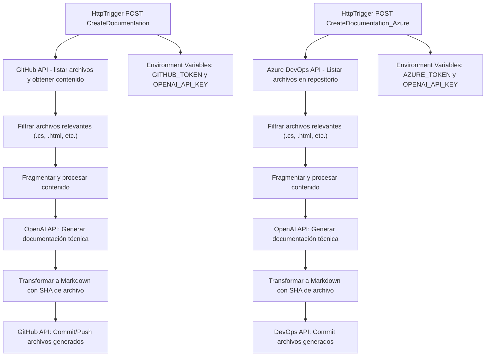

### Breve resumen técnico:
El repositorio parece estar diseñado para dos **Azure Functions** que automatizan la generación de documentación técnica para proyectos alojados en **GitHub** y **Azure DevOps**. Cada función toma datos de archivos, fragmenta su contenido, lo procesa utilizando OpenAI GPT-4 para generar documentación en formato Markdown, y posteriormente almacena o actualiza esos archivos en repositorios remotos.

---

### Descripción de arquitectura:
La arquitectura del repositorio se basa en **Azure Functions** como un modelo de **serverless computing**. La solución utiliza funciones HTTP Trigger para recibir las solicitudes y procesar el contenido. La arquitectura es principalmente de tipo **monolítica de una capa**, pero adopta principios de microservicios en el sentido funcional al ser independiente y orientada a tareas específicas.

Las funciones están diseñadas para interactuar con APIs externas, como:
- **GitHub REST API** para obtener y actualizar archivos en repositorios públicos o privados.
- **Azure DevOps API** para gestionar repositorios en ambientes empresariales.
- **OpenAI API** para generar documentación precisa mediante procesamiento de texto.

---

### Tecnologías usadas:
1. **Lenguaje**: C#.
2. **Framework principal**: 
   - .NET (incluyendo ASP.NET Core y Azure Functions SDK).
   - **Azure Functions Worker**: Para crear y ejecutar funciones de Azure de manera eficiente.
3. **Integración externa**:
   - **GitHub REST API**: Acceso y manipulación de repositorios.
   - **Azure DevOps API**: Gestión de repositorios empresariales en DevOps.
   - **OpenAI API**: Uso de modelos GPT-4 para procesamiento automático de texto.
4. **Patrones de diseño**:
   - **Inyección de dependencias**: Usando `ILoggerFactory` para obtener `ILogger` y crear instancias reutilizables de `HttpClient`.
   - **Factory Method**: Implementación de las funciones dentro de clases con dependencias configuradas externamente.
   - **Gateway/Adapter Pattern**: Uso de adaptadores para interactuar con servicios externos (e.g., GitHub API, Azure DevOps API, OpenAI API).

---

### Arquitectura:
La solución implementada sigue un modelo **funcional serverless** basado en funciones independientes. Aunque el diseño utiliza una combinación de capas (e.g., capa de servicios vía `HttpClient`), la arquitectura focaliza en:
1. **Serverless Monolito**: Las Azure Functions encapsulan todo su comportamiento y lógica en piezas funcionales, pero todas viven dentro de un solo repositorio/proyecto, lo que los hace más monolíticos que microservicios.
2. **Principios desacoplados**:
   - Cada función resuelve tareas específicas como:
      - Interacción con repositorios remotos (GitHub/Azure).
      - Generación de documentación técnica (OpenAI).
      - Fragmentación y almacenamiento.
   - Aunque el código es monolítico, el desacoplamiento entre lógica permite una modularidad considerable.

---

### Dependencias o componentes externos:
1. **GitHub API**:
   - Autenticación mediante **GitHub personal tokens** (`GITHUB_TOKEN`).
   - Manipulación de archivos, branches y SHA de contenido.
2. **Azure DevOps API**:
   - Autenticación mediante **Azure Personal Access Tokens** (`AZURE_TOKEN`).
   - Funcionalidad avanzada para ambientes empresariales, como manejo de commits y branches.
3. **OpenAI API**:
   - Generación de contenido automatizado utilizando modelos preentrenados (`OPENAI_API_KEY`).
   - Segmentación en fragmentos para optimizar uso de tokens GPT.
4. **Application Insights (opcional)**:
   - Telemetría (comentada en el proyecto y no habilitada de forma predeterminada).

---

### Diagrama Mermaid:

---

### Conclusión final:
El repositorio presenta una solución eficiente basada en **Azure Functions** para automatizar la generación de documentación técnica en **Markdown**. Con una arquitectura **serverless** simplificada, el sistema se centra en tareas específicas y usa servicios externos como GitHub, Azure DevOps y OpenAI de manera integral.

Puntos destacados:
- Modularidad clara entre las funciones y los servicios integrados.
- Dependencias centralizadas en componentes externos, facilitando adaptabilidad.
- Uso de buenas prácticas de diseño, como inyección de dependencias y adaptadores para interactuar con APIs.

Sin embargo, tiene un enfoque monolítico, pues todas las tareas están agrupadas dentro de un único código base. Esto podría dificultar escalar individualmente tareas específicas en casos de un alto volumen de solicitudes.